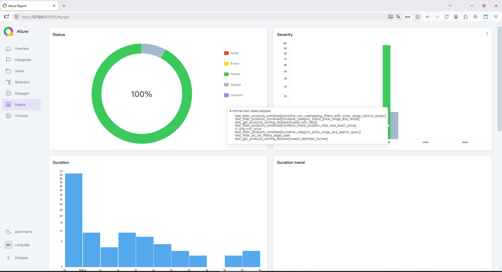
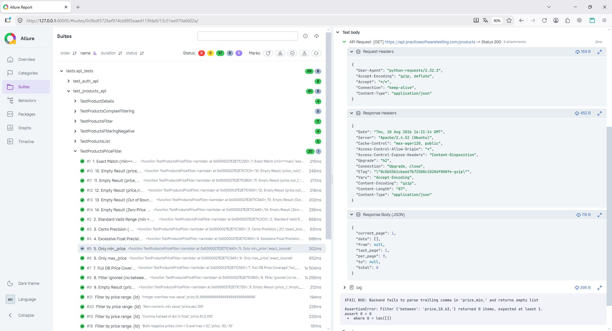
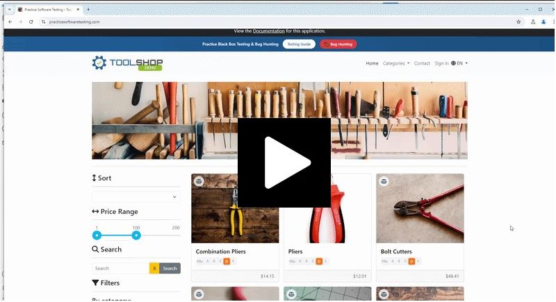

# nexus_qa

[](https://github.com/OldBonzor/nexus_qa/actions/workflows/ci.yml)
[](https://www.python.org/)
[](https://docs.pytest.org/)
[](https://playwright.dev/python/)
[](https://github.com/allure-framework/allure2)
[](https://www.docker.com/)

**Production-ready Hybrid API/UI Automation Framework** designed with a modular, decoupled architecture to ensure scalable and maintainable test execution.

Built to validate modern Single Page Applications (SPAs) and REST APIs, this project demonstrates professional QA automation practices, clean Python code standards, and pragmatic engineering decisions.

---

## 🏗️ Project Architecture & Tech Stack

The framework adopts a layered architecture, decoupling API interactions, UI interactions, configuration handling, and test specifications. This design reduces test flakiness and ensures sustainable, long-term test maintainability.

### 🛠️ Core Technology Stack
*   **Language:** Python 3.12
*   **UI Engine:** Playwright 1.45
*   **API Client:** Requests
*   **Validation:** Pydantic v2
*   **Config:** Pydantic-Settings v2
*   **Reporting:** Allure
*   **Infrastructure:** Docker & Docker Compose
*   **CI/CD:** GitHub Actions

### 📁 Directory Structure
```text
nexus_qa/
├── .github/
│   └── workflows/
│       └── ci.yml               # GitHub Actions CI/CD pipeline definition
├── config/
│   ├── __init__.py
│   ├── config.py                # Environment configuration loader
│   └── settings.py              # Pydantic BaseSettings schema validation
├── src/
│   ├── __init__.py
│   ├── api/                     # API Layer
│   │   ├── __init__.py
│   │   ├── base_client.py       # Abstract Base Contract & concrete requests-based BaseClient
│   │   ├── products_client.py
│   │   └── models/
│   │       ├── auth_models.py
│   │       └── product_models.py
│   └── ui/                      # UI Layer (Page Object Models)
│       ├── __init__.py
│       └── pages/
│           ├── __init__.py
│           ├── base_page.py     # Common Playwright interactions & wrapped logging
│           ├── cart_page.py
│           ├── checkout_page.py
│           ├── inventory_page.py
│           └── login_page.py
├── tests/                       # Separated Test Specifications
│   ├── __init__.py
│   ├── conftest.py              # Shared fixtures (API clients, env configuration)
│   ├── api_tests/               # API specific test suites
│   │   ├── __init__.py
│   │   ├── test_auth_api.py
│   │   └── test_products_api.py
│   └── ui_tests/                # UI specific test suites
│       ├── __init__.py
│       ├── conftest.py          # UI fixtures (browser lifecycle, authenticated pages)
│       ├── test_auth_ui.py
│       ├── test_cart_checkout.py
│       ├── test_catalog_api_mock.py
│       ├── test_catalog_pagination_smoke.py
│       └── test_catalog_ui.py
├── .dockerignore
├── .env.example                 # Template for local environment variables
├── .gitignore
├── docker-compose.yml           # Local multi-container/orchestrated runtime setup
├── Dockerfile                   # Python-Playwright headless base-image recipe
├── pytest.ini                   # CLI arg options, custom logging formats, & marker setup
├── README.md                    # Core project documentation
└── requirements.txt             # Pinned third-party dependencies
```

### 🧠 Architectural Decisions Highlight

#### 📡 1. API Layer Architecture
* **Contract Enforcement (abc.ABC):** Enforces uniform HTTP signatures across client modules, preventing integration mismatches.
* **Session Management:** Wraps `requests.Session` to leverage connection pooling and persist auth-headers/cookies, optimizing performance.
* **Automatic Data Masking:** Recursive inspection masks sensitive keys (auth/tokens) in Allure, ensuring security compliance.
* **DTO Validation (Pydantic v2):** Strict schema modeling catches contract drifts early, shifting testing left.
* **Domain-Specific Clients:** Encapsulate business logic above the transport layer, keeping test scripts clean of HTTP implementation details.
* **Dynamic Test Logic:** API filtering tests adapt to DB states (price/brand/category), covering edge cases like floating-point precision, NULL handling, and pagination integrity.

#### 🖥️ 2. UI Layer Architecture
* **Page Object Model (POM):** Encapsulates locators within `BasePage`, serving as a single source of truth to reduce maintenance overhead.
* **SPA Synchronization:** Explicit checks for dynamic load states ensure browser execution remains in sync with frontend rendering.
* **Auto-Waiting & Resilience:** Leverages Playwright's native state assertions to neutralize race conditions without arbitrary pauses.
* **Network Mocking (`page.route`):** Decouples UI tests from backend/service downtime by intercepting API responses in-browser.
* **Logging & Traceability:** Wraps browser interactions to provide clear execution steps, fully integrated with Allure reporting.

#### 📊 3. Observability & Reporting (Allure & Playwright Traces)
* **Allure Integration:** Structured test execution using Allure steps, attachments, and metadata annotations across API and UI layers.
* **Artifacts Failure Capture:** Test failures automatically trigger screenshot, trace, and log attachments for rapid debugging.

#### ⚖️ 4. Engineering Trade-offs
* **Hybrid Testing Strategy:** UI tests focus exclusively on visual and user-journey assertions rather than setup boilerplate. Setup steps are kept lean, relying on direct execution where appropriate.
* **CI Pipeline Optimization:** GitHub Actions free-tier runners experience timeout issues on UI tests due to network latency between cloud runners and the external test target, alongside occasional instability running browser automation in headless container environments. To address this:
    * **Automated Commit Pipeline:** Triggers only lightweight API smoke tests on push events.
    * **Local Execution Strategy:** Execute heavy UI test suites locally (via IDE or Docker container) to bypass cloud network and resource limits. Note that the `ui` workflow dispatch option in CI is provided primarily for demonstration and configuration completeness rather than reliable remote execution.

---

## ⚡ Quick Start & Local Execution

### 1. Local Run via Python Virtual Environment

Ensure you have **Python 3.12** installed on your host system.

> **⚠️ Security Warning:** The `.env` file contains sensitive environment-specific credentials. Never commit this file to public repositories. Ensure that `.env` is listed in your `.gitignore` to avoid accidental exposure of testing credentials or API keys.

```bash
# Clone the repository
git clone git@github.com:OldBonzor/nexus_qa.git
cd nexus_qa

# Create and activate virtual environment
python -m venv .venv
source .venv/bin/activate  # On Windows use: .venv\Scripts\activate

# Install dependencies
pip install --upgrade pip
pip install -r requirements.txt

# Install Playwright system dependencies and headless browsers
playwright install --with-deps

# Verify environment and pytest setup
pytest --markers

# Create environment configuration file from template
cp .env.example .env
# Open the newly created .env file and replace change_me_to_real_password
# with the actual test account password (welcome01)
```

### 2. Containerized Run via Docker Compose

Run the entire suite headlessly in an isolated Docker container mirroring the exact CI environment. Test artifacts and Allure results are automatically mapped to your local machine via volume mounting:

```bash
# Build the test runner container and execute all default tests
docker compose up --build
```

### 3. Run Specific Marker Suites

The framework registers custom markers in `pytest.ini` to filter and target specific layers of the test stack:

```bash
# Run smoke tests (API & UI check)
pytest -m smoke

# Run all API tests
pytest -m api

# Run all Playwright UI tests
pytest -m ui

# Run the complete test suite (both API and UI)
pytest
```

#### Customizing UI Runs (CLI Options)
When executing Playwright UI tests locally, you can override default execution parameters using custom command-line options:
* `--headed`: Runs tests in headed browser mode (overrides `HEADLESS_MODE` setting).
* `--viewport-width <int>` & `--viewport-height <int>`: Sets custom viewport dimensions (default is `1920x1080`).
* `--zoom <float>`: Applies a page zoom level (e.g., `0.8`), which is particularly useful for video/screen recordings of test runs.

*Example:*
```bash
pytest tests/ui/ -m ui --headed --viewport-width 1280 --viewport-height 720 --zoom 0.9
```

--- 

## 📊 Reporting & Visual Debugging

### 1. Allure HTML Reports
The framework outputs native JSON metadata into `allure-results/` (this directory is automatically cleared at the start of each test run).

> **Prerequisite:** To view reports locally, ensure you have [Allure Commandline](https://allure.qameta.io/#_installing_a_commandline) installed (`npm install -g allure-commandline`), as it is required to generate and serve the HTML dashboard.

To generate and view the HTML report locally, execute:

```bash
# Generate and serve the Allure HTML report in your default browser
allure serve allure-results
```

### 2. Playwright Failure Artifacts
The framework automatically captures diagnostic data upon test failure, which is attached to the Allure report:
* **Screenshots:** Captured at the moment of failure.
* **Traces:** Playwright trace archives (`trace.zip`) capturing network activity, console logs, and DOM snapshots for debugging.

## 🔍 Identified Stability Issues
During the development of the test suite, backend stability issues were identified in the target application. These are explicitly tracked via `pytest` markers to maintain CI pipeline integrity while documenting areas for potential backend remediation:

| Issue Type | Endpoint | Root Cause | Handling Strategy |
| :--- | :--- | :--- | :--- |
| **HTTP 500** | `/products?sort=invalid_field,asc` | SQL Column Exception | `@pytest.mark.xfail` |
| **HTTP 500** | `/products?sort=price-asc` | String Delimiter Error | `@pytest.mark.xfail` |

### 📊 Execution Demonstration

#### Allure Reporting Dashboard
The framework integrates with **Allure Reports** to provide execution metrics, duration tracking, and test status summaries:



#### Failure Analysis & Traceability
The framework automates the collection of diagnostic artifacts upon test failure, enabling rapid root-cause analysis:



#### UI Execution Walkthrough
> Click the image below to play the test execution demonstration:

[](assets/nexus_qa_ui_tests_demo.gif)

---

## ⛓️ CI/CD Pipeline Architecture

The workflow pipeline is powered by **GitHub Actions** and structured to optimize resource allocation and guarantee developer feedback loops:

```
  Push / PR Event                      Manual Trigger (workflow_dispatch)
        │                                              │
        ▼                                              ▼
 ┌──────────────┐                       ┌─────────────────────────────┐
 │ Execute:     │                       │        Select Suite:        │
 │ API Smoke    │                       │ api smoke/api/ui/regression │
 └──────┬───────┘                       └──────────────┬──────────────┘
        │                                              │
        └──────────────────────┬───────────────────────┘
                               │
                               ▼
                    ┌─────────────────────┐
                    │ Build Docker Image  │
                    │ (With Layer Cache)  │
                    └──────────┬──────────┘
                               │
                               ▼
                    ┌─────────────────────┐
                    │ Run pytest Suite    │
                    │ Inside Container    │
                    └──────────┬──────────┘
                               │
                               ▼
                    ┌─────────────────────┐
                    │ Upload Artifacts    │
                    │  (Allure Results)   │
                    └─────────────────────┘
```

### 🚀 Automation Pipeline Hooks
1. **On `push` / `pull_request` (Targeting `main`):** Builds a cached Docker container and triggers the lightweight API smoke suite for rapid feedback.
2. **On `workflow_dispatch` (Manual Trigger):** Allows engineers to run specific suites (`smoke`, `api`, `ui`, `regression`) dynamically from the GitHub Actions console UI (note: CI `smoke` runs API-only to prevent infrastructure bottlenecks, see "Engineering trade-offs").
3. **Artifact Preservation:** Post-execution, the workflow zips and uploads the `allure-results` folder as a workflow run artifact, retained for 30 days.

---

## 🔮 Future Improvements & Expansion Roadmap

The framework architecture is ready for future scaling. Potential areas for expansion include:

* **Parallel Execution:** Implementing `pytest-xdist` for API suites or Playwright sharding for UI suites to reduce overall execution time.
* **Environment Scalability:** Extending the current Docker Compose setup for larger-scale execution environments or remote browser instances if needed.
* **Centralized Test Management:** Evaluating Allure TestOps for advanced reporting, historical trend analysis, and test case lifecycle management.

---

## 📄 License
This project is licensed under the terms of the [MIT License](LICENSE).